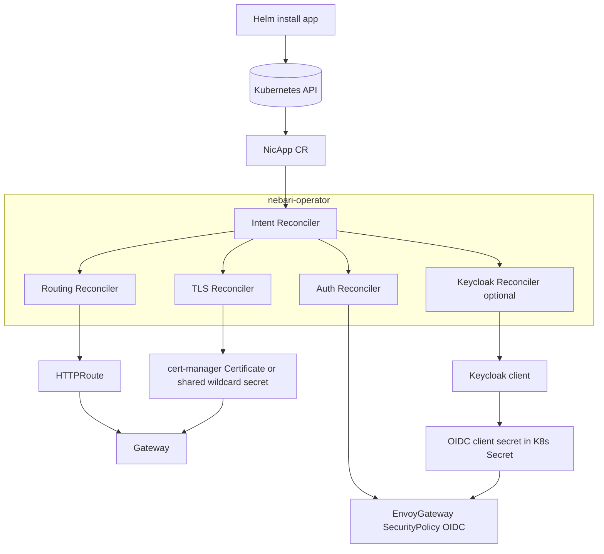

# nebari-operator

Kubernetes Operator designed to streamline and centralize the configuration of **routing**, **TLS certificates**, and
**SSO authentication** within the NIC ecosystem.

This project targets a GitOps-friendly platform where:
- **Argo CD** deploys application Helm charts (the “workloads/apps”) -
  [NS/EW traffic management](https://devcookies.medium.com/north-south-vs-east-west-traffic-in-microservices-a-complete-guide-0e458fe4e605):
  - **Envoy Gateway (Gateway API)** provides north/south traffic entry
  - **Istio** provides mesh capabilities (east/west, optional policies)
- **cert-manager** provisions/renews TLS certificates
- **Keycloak** provides authentication / user & client management

The operator’s purpose is to enable self-service onboarding: > “When a new app is installed via Helm/Argo CD, the
platform automatically wires DNS/TLS, routes, and SSO.”


## Goals

- Provide a single onboarding __contract__ for apps (via a CRD or annotation-based intent).
- Automatically reconcile:
  - **Gateway API routes** (e.g., `HTTPRoute`)
  - **TLS** (cert-manager driven)
  - **SSO/OIDC enforcement** at the edge (Envoy Gateway policies)
  - **Keycloak client provisioning** for each onboarded app
- Be **GitOps-compatible**:
  - Users/app charts define intent
  - Operator renders/owns generated platform resources
  - Changes are declarative and continuously reconciled



See the Architectural decision issue for more information. [soon]
## Installation

### Using kubectl (Recommended)

Install the latest release directly from GitHub:

```bash
kubectl apply -f https://github.com/nebari-dev/nebari-operator/releases/latest/download/install.yaml
```

Or install a specific version:

```bash
kubectl apply -f https://github.com/nebari-dev/nebari-operator/releases/download/v1.0.0/install.yaml
```

### Using Kustomize

Clone the repository and use kustomize:

```bash
git clone https://github.com/nebari-dev/nebari-operator.git
cd nebari-operator
make deploy IMG=quay.io/nebari/nebari-operator:latest
```

### Verify Installation

Check that the operator is running:

```bash
kubectl get pods -n nebari-operator-system
kubectl logs -n nebari-operator-system deployment/nebari-operator-controller-manager
```

## Quick Start

Create a sample NebariApp to expose your service:

```yaml
apiVersion: reconcilers.nebari.dev/v1
kind: NebariApp
metadata:
  name: my-app
  namespace: default
spec:
  hostname: my-app.nebari.local
  service:
    name: my-service
    port: 8080
  tls:
    enabled: true
    mode: wildcard
  auth:
    enabled: false
```

Apply the configuration:

```bash
kubectl apply -f my-app.yaml
```

For more examples and configuration options, see the [Configuration Reference](docs/configuration-reference.md).

## Documentation

- [Configuration Reference](docs/configuration-reference.md) - Complete reference for all NebariApp options
- [Makefile Reference](docs/makefile-reference.md) - Guide to Makefile targets and CI/CD integration
- [Release Process](docs/release-process.md) - How releases are created and managed
- [Release Checklist](docs/release-checklist.md) - Step-by-step checklist for releases
- [GitHub Secrets Setup](docs/github-secrets-setup.md) - Configure secrets for automated releases

## Development

### Prerequisites

- Go 1.24 or later
- Docker or Podman
- kubectl
- A Kubernetes cluster (kind, minikube, etc.)
- make (for using the Makefile)

### Using the Makefile

The project uses a Kubebuilder-generated Makefile that provides convenient targets for development. See the
[Makefile Reference](docs/makefile-reference.md) for complete documentation.

**Common commands**:
```bash
make help          # Show all available targets
make fmt           # Format code
make vet           # Run static analysis
make test          # Run tests
make lint          # Run linter
make manifests     # Generate CRDs and RBAC
make generate      # Generate DeepCopy code
make build         # Build binary
make docker-build  # Build Docker image
```

### Running Locally

```bash
# Install dependencies and generate code
make manifests
make generate

# Run tests
make test

# Run linter
make lint

# Run the operator locally
make run
```

### Building

```bash
# Build the binary
make build

# Build Docker image
make docker-build IMG=quay.io/nebari/nebari-operator:dev

# Push Docker image
make docker-push IMG=quay.io/nebari/nebari-operator:dev
```

## Contributing

We welcome contributions! Please:

1. Fork the repository
2. Create a feature branch
3. Make your changes
4. Add tests
5. Run `make fmt`, `make vet`, `make test`, and `make lint`
6. Submit a pull request

### Pull Request Builds

When you open a pull request:
- ✅ Tests run automatically
- ✅ Code is validated with linters
- ✅ Docker images are built with your branch name as tag
- ✅ A comment is added to your PR with the image details

You can use the PR image to test your changes:
```bash
kubectl set image deployment/nebari-operator-controller-manager \
  manager=quay.io/nebari/nebari-operator:your-branch-name \
  -n nebari-operator-system
```

## Releases

Releases are automated via GitHub Actions. When a new release is created on GitHub:

1. Tests are run automatically
2. Docker images are built for multiple architectures
3. Go binaries are built for multiple platforms
4. Kubernetes manifests are generated
5. All artifacts are attached to the release

See the [Release Process](docs/release-process.md) for detailed information.

### Latest Release

Check the [Releases page](https://github.com/nebari-dev/nebari-operator/releases) for the latest version.

### Container Images

Container images are available at:
```
quay.io/nebari/nebari-operator:latest
quay.io/nebari/nebari-operator:<version>
```

## License

Licensed under the Apache License, Version 2.0. See [LICENSE](LICENSE) for details.

## Support

- Report issues: [GitHub Issues](https://github.com/nebari-dev/nebari-operator/issues)
- Documentation: [docs/](docs/)
