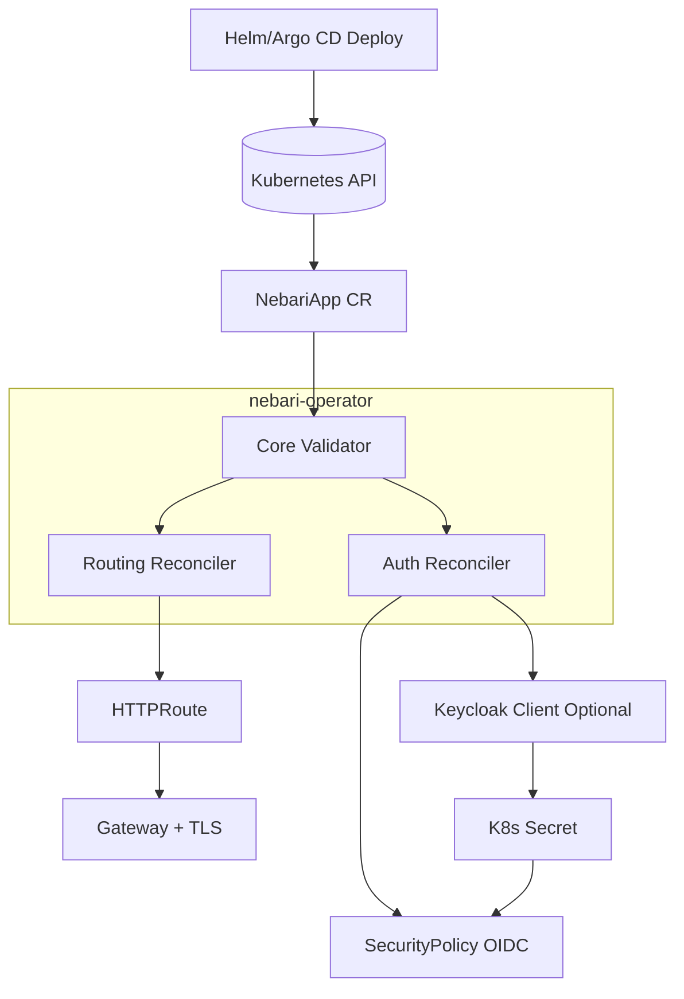

# NIC Operator

Kubernetes Operator that streamlines **routing**, **TLS certificates**, and **SSO authentication** configuration for
applications in the Nebari NIC ecosystem.

## Overview

The NIC Operator enables **self-service application onboarding** in GitOps-friendly Kubernetes platforms. When a new app
is deployed via Helm or Argo CD, the operator automatically configures:

- **HTTP/HTTPS Routes** (Gateway API HTTPRoute)
- **TLS Certificates** (via cert-manager)
- **SSO Authentication** (OIDC with Keycloak)
- **Security Policies** (Envoy Gateway SecurityPolicy)

### Platform Architecture

This operator works within a platform that includes:
- **Argo CD** - GitOps application deployment
- **Envoy Gateway** - Gateway API implementation (north/south traffic)
- **cert-manager** - TLS certificate provisioning and renewal
- **Keycloak** - OIDC authentication provider (optional)



## Quick Start

Get started in 5 minutes! Follow our [Quick Start Guide](docs/quickstart.md) to:

1. Install the operator
2. Set up platform prerequisites
3. Deploy your first application
4. Enable authentication

**Prerequisites**: Kubernetes cluster with Gateway API support (Envoy Gateway recommended)

## Features

✅ **Declarative Configuration** - Single CRD defines routing, TLS, and auth ✅ **Automatic Route Generation** - HTTPRoute
resources created automatically ✅ **TLS Management** - Seamless cert-manager integration ✅ **OIDC Authentication** -
Optional SSO with Keycloak ✅ **GitOps Compatible** - Continuously reconciled with desired state ✅ **Multi-Platform** -
Works with any Kubernetes (cloud, on-prem, local) ✅ **Namespace Isolation** - Opt-in per namespace with labels

## Documentation

### Getting Started
- **[Quick Start Guide](docs/quickstart.md)** - Install and deploy your first app (5 min)
- **[Platform Setup](docs/platform-setup.md)** - Infrastructure prerequisites and installation
- **[Configuration Reference](docs/configuration-reference.md)** - Complete NebariApp CRD reference

### Architecture
- **[Reconciler Overview](docs/reconcilers/README.md)** - How the operator works internally
- **[Validation Reconciler](docs/reconcilers/validation.md)** - Namespace and service validation
- **[Routing Reconciler](docs/reconcilers/routing.md)** - Gateway API and HTTPRoute management
- **[Authentication Reconciler](docs/reconcilers/authentication.md)** - OIDC and Keycloak integration

### Operations
- **[Makefile Reference](docs/makefile-reference.md)** - Build, test, and deployment commands
- **[Release Process](docs/maintainers/release-process.md)** - How releases are created and managed
- **[Release Setup](docs/maintainers/release-setup.md)** - GitHub Actions configuration

## Installation

### Quick Install (Recommended)

Install the latest stable release:

```bash
kubectl apply -f https://github.com/nebari-dev/nebari-operator/releases/latest/download/install.yaml
```

### Install Specific Version

```bash
VERSION=v0.1.0
kubectl apply -f https://github.com/nebari-dev/nebari-operator/releases/download/${VERSION}/install.yaml
```

### Verify Installation

```bash
kubectl get pods -n nebari-operator-system
kubectl logs -n nebari-operator-system -l control-plane=controller-manager
```

## Usage Example

Create a NebariApp to expose your service:

```yaml
apiVersion: reconcilers.nebari.dev/v1
kind: NebariApp
metadata:
  name: my-app
  namespace: default
spec:
  hostname: my-app.example.com
  service:
    name: my-service
    port: 8080
  tls:
    enabled: true
    mode: wildcard
  auth:
    enabled: true
    oidc:
      provider: keycloak
      issuer: "https://keycloak.example.com/realms/main"
      clientSecretRef:
        name: my-app-oidc
        namespace: default
```

The operator will automatically create:
- **HTTPRoute** for routing traffic to your service
- **SecurityPolicy** for OIDC authentication (if auth enabled)
- **Keycloak Client** for your application (if configured)

See the [Configuration Reference](docs/configuration-reference.md) for all available options.

## Development

### Prerequisites

- Go 1.24+
- Docker or Podman
- kubectl
- Kubernetes cluster (kind, minikube, or cloud)
- make

### Quick Development Setup

```bash
# Install dependencies
make manifests generate

# Run tests
make test

# Run linter
make lint

# Run operator locally (against configured cluster)
make run
```

### Manual Testing with Kind

Use the automated development environment:

```bash
# Create Kind cluster with full infrastructure
cd dev
make setup

# Build and deploy operator
cd ..
make docker-build IMG=quay.io/nebari/nebari-operator:dev
kind load docker-image quay.io/nebari/nebari-operator:dev --name nic-operator-dev
make install deploy IMG=quay.io/nebari/nebari-operator:dev

# Deploy sample application
kubectl apply -f dev/sample-app-deployment.yaml
kubectl apply -f dev/sample-nebariapp-with-routing.yaml

# Test changes
make docker-build IMG=quay.io/nebari/nebari-operator:dev
kind load docker-image quay.io/nebari/nebari-operator:dev --name nic-operator-dev
kubectl rollout restart deployment nebari-operator-controller-manager -n nebari-operator-system

# Cleanup
cd dev
make teardown
```

See [dev/README.md](dev/README.md) for detailed development workflows.

### Common Makefile Targets

```bash
make help          # Show all available targets
make fmt           # Format code
make vet           # Run static analysis
make test          # Run unit tests
make lint          # Run linter
make build         # Build binary
make docker-build  # Build Docker image
make deploy        # Deploy to cluster
```

See the [Makefile Reference](docs/makefile-reference.md) for complete documentation.

## Contributing

We welcome contributions! Here's how to get started:

1. Fork the repository
2. Create a feature branch (`git checkout -b feature/amazing-feature`)
3. Make your changes
4. Add tests for new functionality
5. Run tests and linters:
   ```bash
   make fmt vet test lint
   ```
6. Commit your changes (`git commit -m 'Add amazing feature'`)
7. Push to your fork (`git push origin feature/amazing-feature`)
8. Open a Pull Request

### Pull Request Builds

When you open a PR:
- ✅ Automated tests run
- ✅ Code is linted and validated
- ✅ Multi-arch Docker images are built
- ✅ A comment with image details is added to your PR

Test your PR image:
```bash
kubectl set image deployment/nebari-operator-controller-manager \
  manager=quay.io/nebari/nebari-operator:your-branch-name \
  -n nebari-operator-system
```

## Releases

Releases are fully automated via GitHub Actions. When a new release is published:

1. ✅ Tests run automatically
2. ✅ Docker images built for amd64 and arm64
3. ✅ Go binaries built for multiple platforms
4. ✅ Helm chart packaged and published
5. ✅ Release notes generated
6. ✅ All artifacts attached to the release

See the [Release Process](docs/release-process.md) for detailed information.

### Latest Release

Check the [Releases page](https://github.com/nebari-dev/nebari-operator/releases) for the latest version.

### Container Images

Images are available at Quay.io:
```
quay.io/nebari/nebari-operator:latest
quay.io/nebari/nebari-operator:v0.1.0
quay.io/nebari/nebari-operator:main
```

## Architecture

The operator uses a pipeline of specialized **reconcilers** to transform a simple `NebariApp` resource into a fully
configured application:

1. **Validation Reconciler** - Ensures prerequisites (namespace opt-in, service exists)
2. **Routing Reconciler** - Creates HTTPRoute and attaches to Gateway
3. **Authentication Reconciler** - Configures OIDC authentication (optional)

Each reconciler operates independently, updating status conditions and emitting Kubernetes events for observability.

**Learn more:** [Reconciler Architecture](docs/reconcilers/README.md)

## License

Licensed under the Apache License, Version 2.0. See [LICENSE](LICENSE) for details.
