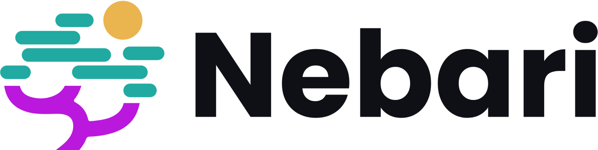

<p align="center">
  <a href="https://nebari.dev">
    <picture>
      <source media="(prefers-color-scheme: dark)" srcset="docs/Nebari-Logo-Horizontal-Lockup-White-text.png">
      <source media="(prefers-color-scheme: light)" srcset="docs/Nebari-Logo-Horizontal-Lockup.png">
      
    </picture>
  </a>
</p>

<h1 align="center">Nebari Operator</h1>

<p align="center">
  <strong>Self-service application onboarding for GitOps-friendly Kubernetes platforms.</strong><br /> One CRD to rule
  routing, TLS, SSO, and landing-page registration — all continuously reconciled.
</p>

<p align="center">
  <a href="https://github.com/nebari-dev/nebari-operator/actions/workflows/test-chart.yml"></a>
  <a href="https://github.com/nebari-dev/nebari-operator/actions/workflows/build-pr.yml"></a> <a
  href="https://github.com/nebari-dev/nebari-operator/actions/workflows/generated-files.yml"></a> <a href="https://github.com/nebari-dev/nebari-operator/actions/workflows/release.yml"></a> <a
  href="https://github.com/nebari-dev/nebari-operator/blob/main/LICENSE"></a> <a
  href="https://github.com/nebari-dev/nebari-operator/releases/latest"></a> <a href="https://golang.org"></a> <a
  href="https://kubernetes.io"></a>
</p>

<p align="center">
  <a href="#what-is-nebari-operator">What is it?</a> &middot; <a href="#how-it-works">How it works</a> &middot; <a
  href="#key-features">Features</a> &middot; <a href="#installation">Installation</a> &middot; <a
  href="#usage-example">Usage</a> &middot; <a href="#development">Development</a> &middot; <a
  href="#documentation">Docs</a> &middot; <a href="CONTRIBUTING.md">Contributing</a>
</p>


> **Status**: Under active development as part of Nebari Infrastructure Core (NIC). APIs and behavior may change without
> notice.

## What is Nebari Operator?

The Nebari Operator is a Kubernetes controller that enables **self-service application onboarding** in GitOps-friendly
clusters. When a team deploys an app via Helm or Argo CD, they declare a single `NebariApp` custom resource — the
operator takes care of the rest:

- **HTTP/HTTPS Routes** — Gateway API `HTTPRoute` created and maintained automatically
- **TLS Termination** — cert-manager `Certificate` provisioned on demand
- **SSO Authentication** — OIDC `SecurityPolicy` wired to Keycloak, including automatic client provisioning
- **Landing Page Registration** — service metadata surfaced to
  [Nebari Landing](https://github.com/nebari-dev/nebari-landing) with visibility controls

No more hand-crafting `Gateway`, `HTTPRoute`, `SecurityPolicy`, or Keycloak clients. Declare intent; the operator
reconciles reality.

## How it Works

The operator runs a pipeline of focused **reconcilers**, each responsible for one concern:

```
NebariApp CR
     │
     ├─► Validation Reconciler    — namespace opt-in, service existence
     ├─► Routing Reconciler       — HTTPRoute + TLS Certificate
     ├─► Auth Reconciler          — OIDC SecurityPolicy + Keycloak client
     └─► Landing Page Reconciler  — registration in nebari-landing cache
```

Each reconciler is independent, updates `status.conditions`, and emits Kubernetes Events for full observability. The
control loop is **continuously reconciled** — drift from desired state is corrected automatically.

**Learn more:** [Reconciler Architecture](docs/reconcilers/README.md)

## Key Features

| Feature | Description |
| --- | --- |
| **Declarative Configuration** | One `NebariApp` CRD defines routing, TLS, auth, and landing-page visibility |
| **Automatic Route Generation** | `HTTPRoute` resources are created and kept in sync automatically |
| **TLS Management** | Seamless cert-manager integration — certificates provisioned and renewed hands-free |
| **OIDC Authentication** | Optional SSO via Keycloak, with automatic `SecurityPolicy` and client provisioning |
| **Public Route Bypass** | Per-path auth bypass for health-check and callback endpoints |
| **Landing Page Integration** | Surfaces apps to [nebari-landing](https://github.com/nebari-dev/nebari-landing) with category, icon, and visibility controls |
| **GitOps Compatible** | Continuously reconciled — desired state is always enforced |
| **Multi-Platform** | Works with any Kubernetes (cloud, on-prem, local kind/minikube) |
| **Namespace Isolation** | Opt-in per namespace via label — no accidental adoption |

## Installation

### Quick Install (Recommended)

Install the latest stable release with a single command:

```bash
kubectl apply -f https://github.com/nebari-dev/nebari-operator/releases/latest/download/install.yaml
```

### Install a Specific Version

```bash
VERSION=v0.1.0
kubectl apply -f https://github.com/nebari-dev/nebari-operator/releases/download/${VERSION}/install.yaml
```

### Helm Install

```bash
helm upgrade --install nebari-operator \
  oci://ghcr.io/nebari-dev/charts/nebari-operator \
  --namespace nebari-operator-system \
  --create-namespace
```

### Verify Installation

```bash
kubectl get pods -n nebari-operator-system
kubectl logs -n nebari-operator-system -l control-plane=controller-manager
```

### Container Images

Multi-arch images (amd64 / arm64) are published to Quay.io on every release:

```
quay.io/nebari/nebari-operator:latest
quay.io/nebari/nebari-operator:v0.1.0
quay.io/nebari/nebari-operator:main
```

## Usage Example

Opt your namespace in and create a `NebariApp` to expose a service:

```bash
# Opt the namespace into operator management
kubectl label namespace my-team nebari.dev/managed=true
```

```yaml
apiVersion: reconcilers.nebari.dev/v1
kind: NebariApp
metadata:
  name: my-app
  namespace: my-team
spec:
  hostname: my-app.example.com
  service:
    name: my-service
    port: 8080
  routing:
    tls:
      enabled: true
    routes:
      - pathPrefix: /
    publicRoutes:
      - pathPrefix: /healthz
        pathType: Exact
  auth:
    enabled: true
    provider: keycloak
    provisionClient: true
  landingPage:
    enabled: true
    displayName: "My App"
    description: "A great internal tool"
    category: "Engineering"
    icon: "tool"
    visibility: authenticated
```

The operator will automatically create:

- **`HTTPRoute`** — routes `my-app.example.com` traffic to `my-service:8080`
- **`Certificate`** — cert-manager certificate for TLS
- **`SecurityPolicy`** — OIDC authentication enforced at the gateway
- **Keycloak Client** — OIDC client provisioned in the configured realm
- **Landing Page Entry** — app surfaced in nebari-landing for authenticated users

See the [Configuration Reference](docs/configuration-reference.md) for all available options.

## Development

### Prerequisites

| Tool | Version | Notes |
| --- | --- | --- |
| `go` | 1.25+ | Controller and tests |
| `docker` or `podman` | 24+ | Image builds |
| `kubectl` | 1.28+ | Cluster interaction |
| `make` | any | Build automation |
| Kubernetes cluster | 1.28+ | kind, minikube, or cloud |

### Quick Start

```bash
# Regenerate CRDs and deep-copy code after API changes
make manifests generate

# Run unit tests
make test

# Run linter
make lint

# Run the operator locally against your current cluster
make run
```

### Local Dev Cluster (Kind)

```bash
# Create a Kind cluster with the full Nebari infrastructure stack
cd dev && make setup

# Build and load the operator image
cd ..
make docker-build IMG=quay.io/nebari/nebari-operator:dev
kind load docker-image quay.io/nebari/nebari-operator:dev --name nebari-operator-dev

# Install CRDs and deploy
make install deploy IMG=quay.io/nebari/nebari-operator:dev

# Deploy the example app and NebariApp CR
kubectl apply -f dev/examples/app-deployment.yaml
kubectl apply -f dev/examples/nebariapp.yaml

# Iterate: rebuild and roll out
make docker-build IMG=quay.io/nebari/nebari-operator:dev
kind load docker-image quay.io/nebari/nebari-operator:dev --name nebari-operator-dev
kubectl rollout restart deployment nebari-operator-controller-manager -n nebari-operator-system

# Tear down
cd dev && make teardown
```

See [dev/README.md](dev/README.md) for the full local development guide.

### Common Makefile Targets

```bash
make help          # List all available targets with descriptions
make fmt           # Format code (go fmt)
make vet           # Run static analysis (go vet)
make test          # Run unit tests
make test-e2e      # Run end-to-end tests (requires a live cluster)
make lint          # Run golangci-lint
make build         # Build the manager binary
make docker-build  # Build the Docker image
make deploy        # Deploy to the current cluster
make generate-dev  # Shortcut: manifests + generate (after API changes)
```

See the [Makefile Reference](docs/makefile-reference.md) for the complete target list.

### Releasing (Maintainers)

```bash
# Tag and push from main
git checkout main && git pull origin main
git tag -a v1.0.0 -m "Release v1.0.0"
git push origin v1.0.0

# Create the GitHub release — CI takes it from here
gh release create v1.0.0 --generate-notes
```

CI automatically: runs tests · builds multi-arch images · packages the Helm chart · generates `install.yaml` · uploads
all artifacts.

See [docs/maintainers/release-checklist.md](docs/maintainers/release-checklist.md) for the complete process.

## Documentation

### Getting Started
- **[Quick Start Guide](docs/quickstart.md)** — Install and deploy your first app in 5 minutes
- **[Configuration Reference](docs/configuration-reference.md)** — Complete `NebariApp` CRD reference
- **[Troubleshooting](docs/troubleshooting.md)** — Common issues and how to fix them

### Architecture & Internals
- **[Reconciler Overview](docs/reconcilers/README.md)** — How the operator pipeline works
- **[Validation Reconciler](docs/reconcilers/validation.md)** — Namespace opt-in and service checks
- **[Routing Reconciler](docs/reconcilers/routing.md)** — Gateway API and `HTTPRoute` management
- **[Authentication Reconciler](docs/reconcilers/authentication.md)** — OIDC, Keycloak, and `SecurityPolicy`

### Operations
- **[Makefile Reference](docs/makefile-reference.md)** — All build, test, and deployment targets
- **[Release Process](docs/maintainers/release-process.md)** — How releases are created
- **[Release Checklist](docs/maintainers/release-checklist.md)** — Step-by-step release guide for maintainers
- **[Release Setup](docs/maintainers/release-setup.md)** — GitHub Actions configuration

## Contributing

Contributions are welcome! To get started:

```bash
git clone https://github.com/nebari-dev/nebari-operator.git
cd nebari-operator

# Make your changes, then:
make fmt vet test lint
```

1. Fork the repo and create a feature branch (`git checkout -b feat/my-feature`)
2. Add tests for new functionality
3. Ensure `make fmt vet test lint` passes
4. Open a Pull Request — CI will build multi-arch images and post image details

**Documentation**:
- **[Contributing Guide](CONTRIBUTING.md)** — Development workflow and conventions
- **[API Reference](docs/api-reference.md)** — Auto-generated CRD field reference

See our [issue tracker](https://github.com/nebari-dev/nebari-operator/issues) for open issues and ideas.

## License

Apache License 2.0 — see [LICENSE](LICENSE) for details.
