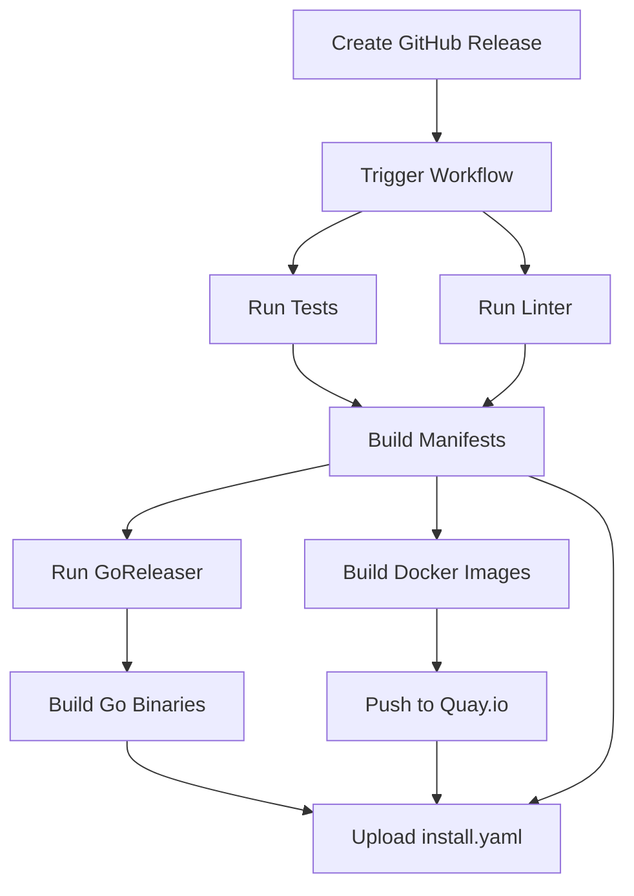

# Automated Release Setup - Summary

This document provides an overview of the automated release system for the Nebari Operator.

## What Was Set Up

The release automation includes:

1. **GitHub Actions Workflow** (`.github/workflows/release.yml`)
   - Triggers on GitHub Release creation
   - Runs tests and linting
   - Builds multi-architecture Docker images
   - Publishes Go binaries
   - Generates Kubernetes manifests
   - Uploads all artifacts to the release

2. **GoReleaser Configuration** (`.goreleaser.yml`)
   - Builds binaries for multiple platforms (Linux, macOS, Windows)
   - Creates archives with documentation
   - Generates checksums
   - Creates structured changelog
   - Attaches artifacts to GitHub Release

3. **Version Package** (`internal/version/version.go`)
   - Provides version information in the binary
   - Version info is injected at build time

4. **Documentation**
   - [Release Process Guide](release-process.md) - Complete instructions
   - [GitHub Secrets Setup](github-secrets-setup.md) - How to configure secrets
   - [Release Checklist](release-checklist.md) - Step-by-step checklist

## Quick Start

### First-Time Setup

1. **Configure Quay.io Secrets** (one-time setup):

   Follow the [GitHub Secrets Setup Guide](github-secrets-setup.md) to add:
   - `QUAY_USERNAME`: Your Quay.io robot account name
   - `QUAY_PASSWORD`: Your Quay.io robot account token

2. **Verify the setup** with a test release:
   ```bash
   git tag -a v0.0.1-test -m "Test release"
   git push origin v0.0.1-test
   ```
   Then create a GitHub Release and watch the Actions workflow.

### Creating a Release

1. **Prepare the code**:
   ```bash
   make test        # Run tests
   make lint        # Run linter
   make manifests   # Update manifests
   ```

2. **Create and push a tag**:
   ```bash
   git tag -a v1.0.0 -m "Release v1.0.0"
   git push origin v1.0.0
   ```

3. **Create GitHub Release**:
   - Go to GitHub → Releases → Draft a new release
   - Select the tag (v1.0.0)
   - Write release notes
   - Click "Publish release"

4. **Monitor the workflow** in the Actions tab

That's it! The automation handles everything else.

## What Gets Released

### Docker Images (Quay.io)

```
quay.io/nebari/nebari-operator:v1.0.0
quay.io/nebari/nebari-operator:latest
```

Architectures: `linux/amd64`, `linux/arm64`

### Go Binaries (GitHub Release)

- Linux (amd64, arm64)
- macOS (amd64, arm64)
- Windows (amd64)

### Kubernetes Manifests (GitHub Release)

- `install.yaml` - Complete installation file with CRDs, RBAC, and deployment

### Additional Files

- `checksums.txt` - SHA256 checksums
- Source code archives (auto-generated by GitHub)

## Workflow Overview



## Workflow Jobs

### 1. Tests (`tests`)
- Runs unit tests
- Runs linter
- Ensures code quality before release

### 2. Build Manifests (`build-manifests`)
- Generates CRDs and RBAC
- Creates consolidated `install.yaml`
- Uploads as artifact

### 3. Docker Build & Push (`docker-build-push`)
- Builds multi-arch images
- Pushes to Quay.io
- Tags with version and latest

### 4. GoReleaser (`goreleaser`)
- Builds Go binaries
- Creates archives
- Generates checksums
- Uploads to GitHub Release

### 5. Upload Manifests (`upload-manifests`)
- Attaches `install.yaml` to release
- Makes it available for kubectl apply

## Directory Structure

```
.
├── .github/
│   └── workflows/
│       └── release.yml          # Main release workflow
├── .goreleaser.yml              # GoReleaser configuration
├── internal/
│   └── version/
│       └── version.go           # Version information
├── docs/
│   ├── release-process.md       # Complete guide
│   ├── github-secrets-setup.md  # Secrets configuration
│   ├── release-checklist.md     # Step-by-step checklist
│   └── release-setup.md         # This file
├── dist/                        # Generated artifacts (gitignored)
└── Dockerfile                   # Container build file
```

## Configuration Files

### `.github/workflows/release.yml`

The main GitHub Actions workflow that orchestrates the entire release process.

**Key features:**
- Triggers on release creation
- Multi-stage build process
- Parallel job execution
- Artifact sharing between jobs

### `.goreleaser.yml`

Configuration for GoReleaser to build and package Go binaries.

**Key features:**
- Multi-platform builds
- Custom ldflags for version injection
- Changelog generation
- Archive creation

### `internal/version/version.go`

Version information package that can be imported by the operator.

**Usage in code:**
```go
import "github.com/nebari-dev/nebari-operator/internal/version"

func main() {
    info := version.Get()
    fmt.Printf("Version: %s\n", info.Version)
    fmt.Printf("Commit: %s\n", info.Commit)
    fmt.Printf("Built: %s\n", info.Date)
}
```

## Environment Variables

The workflow uses the following environment variables:

- `REGISTRY`: Container registry (quay.io)
- `IMAGE_NAME`: Image name (nebari/nebari-operator)
- `GITHUB_REF_NAME`: Tag name from GitHub
- `GITHUB_TOKEN`: Auto-provided by GitHub Actions

## Secrets Required

| Secret | Description | Where to Get |
|--------|-------------|--------------|
| `QUAY_USERNAME` | Quay.io robot account name | Quay.io → Organization → Robot Accounts |
| `QUAY_PASSWORD` | Quay.io robot account token | Same as above |
| `GITHUB_TOKEN` | GitHub API token | Auto-provided by Actions |

## Platform Support

### Docker Images
- ✅ linux/amd64
- ✅ linux/arm64

### Go Binaries
- ✅ linux/amd64
- ✅ linux/arm64
- ✅ darwin/amd64 (Intel Mac)
- ✅ darwin/arm64 (Apple Silicon)
- ✅ windows/amd64

## Versioning Strategy

We follow [Semantic Versioning](https://semver.org/):

- **v1.0.0** - Major version (breaking changes)
- **v1.1.0** - Minor version (new features, backward compatible)
- **v1.1.1** - Patch version (bug fixes)

Pre-release versions:
- **v1.0.0-alpha.1** - Alpha release
- **v1.0.0-beta.1** - Beta release
- **v1.0.0-rc.1** - Release candidate

## Testing the Release

After a release is created, verify:

1. **Docker image is available**:
   ```bash
   docker pull quay.io/nebari/nebari-operator:v1.0.0
   ```

2. **Manifests work**:
   ```bash
   kubectl apply -f https://github.com/nebari-dev/nebari-operator/releases/download/v1.0.0/install.yaml
   ```

3. **Binaries are downloadable**:
   ```bash
   curl -LO https://github.com/nebari-dev/nebari-operator/releases/download/v1.0.0/nebari-operator_1.0.0_Linux_x86_64.tar.gz
   ```

## Troubleshooting

Common issues and solutions:

| Problem | Solution |
|---------|----------|
| Tests fail | Fix tests and create new release |
| Docker push fails | Check Quay.io secrets are configured |
| GoReleaser fails | Check `.goreleaser.yml` syntax |
| Missing artifacts | Check workflow logs in Actions tab |
| Authentication errors | Verify secrets in Settings → Secrets |

For detailed troubleshooting, see the [Release Process Guide](release-process.md).

## Maintenance

### Updating the Workflow

When updating `.github/workflows/release.yml`:

1. Test changes in a fork or feature branch
2. Use `workflow_dispatch` for manual testing
3. Review Actions logs carefully
4. Update documentation if behavior changes

### Updating GoReleaser

When updating `.goreleaser.yml`:

1. Test locally first:
   ```bash
   goreleaser release --snapshot --clean
   ```
2. Check generated artifacts in `dist/`
3. Validate with `goreleaser check`

### Adding New Platforms

To add support for new platforms:

1. Update `.goreleaser.yml` builds section
2. Update documentation
3. Test the build locally
4. Create a test release

## CI/CD Pipeline

```
Commit → Tag → Release → Workflow Triggered
                            ↓
                    ┌───────┴───────┐
                    ↓               ↓
                Tests           Linter
                    ↓               ↓
                    └───────┬───────┘
                            ↓
                    Build Manifests
                            ↓
                    ┌───────┴───────┐
                    ↓               ↓
            Docker Build     GoReleaser
                    ↓               ↓
                Quay.io         Binaries
                    ↓               ↓
                    └───────┬───────┘
                            ↓
                    Upload Artifacts
                            ↓
                    Release Complete
```

## Next Steps

1. ✅ Set up Quay.io secrets (see [github-secrets-setup.md](github-secrets-setup.md))
2. ✅ Review the [release-process.md](release-process.md) guide
3. ✅ Create a test release to verify everything works
4. ✅ Document any project-specific release procedures
5. ✅ Train team members on the release process

## Resources

- [GitHub Actions Documentation](https://docs.github.com/en/actions)
- [GoReleaser Documentation](https://goreleaser.com/)
- [Semantic Versioning](https://semver.org/)
- [Docker Build Push Action](https://github.com/docker/build-push-action)
- [Quay.io Documentation](https://docs.quay.io/)

## Support

If you encounter issues:

1. Check the workflow logs in GitHub Actions
2. Review the troubleshooting section
3. Consult the detailed guides in `docs/`
4. Create an issue if you find a bug in the automation
