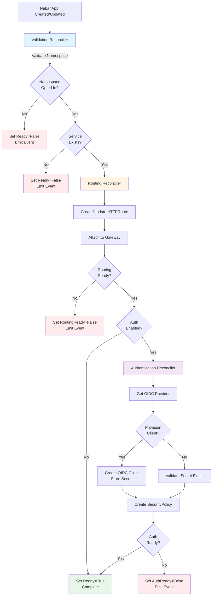

# Reconciler Architecture

This directory contains detailed documentation for each reconciler component in the Nebari Operator.

## What Are Reconcilers?

**Reconcilers** are the core building blocks of the Nebari Operator. Each reconciler is responsible for a specific
aspect of application onboarding:

- **Validation Reconciler** - Ensures prerequisites are met (namespace opt-in, service exists)
- **Routing Reconciler** - Creates and manages Gateway API HTTPRoutes for traffic routing
- **Authentication Reconciler** - Provisions OIDC clients and configures SecurityPolicy for authentication

These reconcilers work together in a coordinated pipeline to transform a simple `NebariApp` custom resource into a fully
configured application with routing, TLS, and optional authentication.

## Reconciliation Flow



## Reconciler Pipeline

### 1. Validation Reconciler

**Purpose:** Ensure all prerequisites are met before proceeding

**Responsibilities:**
- Verify namespace has `nebari.dev/managed=true` label
- Validate referenced Service exists and exposes the specified port
- Set appropriate conditions and emit events for validation failures

**Outcomes:**
- ✅ `Ready=True` with reason `ValidationSuccess` - Proceed to routing
- ❌ `Ready=False` - Stop reconciliation, wait for fixes

**Details:** [validation.md](validation.md)

### 2. Routing Reconciler

**Purpose:** Configure HTTP/HTTPS routing to the application

**Responsibilities:**
- Create or update Gateway API HTTPRoute resources
- Configure hostname-based routing
- Configure path-based routing (if specified)
- Attach routes to the shared Gateway
- Handle TLS/non-TLS listener selection

**Outcomes:**
- ✅ `RoutingReady=True` - Traffic can reach the application
- ❌ `RoutingReady=False` - Gateway or HTTPRoute issues

**Details:** [routing.md](routing.md)

### 3. Authentication Reconciler

**Purpose:** Configure OIDC authentication (when enabled)

**Responsibilities:**
- Select appropriate OIDC provider (Keycloak, generic-oidc)
- Optionally provision OIDC client in provider
- Create or validate client credentials secret
- Create Envoy Gateway SecurityPolicy with OIDC configuration
- Handle group-based authorization

**Outcomes:**
- ✅ `AuthReady=True` - Authentication is configured
- ❌ `AuthReady=False` - OIDC provider or configuration issues

**Details:** [authentication.md](authentication.md)

## Condition Types

The operator manages these conditions on each `NebariApp`:

| Condition | Description | Set By |
|-----------|-------------|--------|
| `Ready` | Overall health - all reconcilers succeeded | All reconcilers |
| `RoutingReady` | HTTPRoute created and Gateway is routing traffic | Routing reconciler |
| `AuthReady` | Authentication configured (if enabled) | Authentication reconciler |

### Condition Reasons

Common reasons you'll see in conditions:

**Success:**
- `ValidationSuccess` - Prerequisites validated
- `ReconcileSuccess` - Reconciliation completed
- `Available` - Resource is functioning

**Failures:**
- `NamespaceNotOptedIn` - Namespace missing required label
- `ServiceNotFound` - Referenced service doesn't exist
- `GatewayNotFound` - Target gateway not found
- `SecretNotFound` - OIDC client secret missing
- `Failed` - General reconciliation failure

## Event Recording

Reconcilers emit Kubernetes events to provide visibility into operations:

**Validation Events:**
- `ValidationSuccess` (Normal) - Validation passed
- `ValidationFailed` (Warning) - Validation failed
- `NamespaceNotOptedIn` (Warning) - Namespace not labeled
- `ServiceNotFound` (Warning) - Service doesn't exist

**Routing Events:**
- `HTTPRouteCreated` (Normal) - HTTPRoute created
- `HTTPRouteUpdated` (Normal) - HTTPRoute updated
- `HTTPRouteDeleted` (Normal) - HTTPRoute deleted
- `TLSConfigured` (Normal) - TLS configured successfully
- `GatewayNotFound` (Warning) - Gateway not available

**Authentication Events:**
- `ClientProvisioned` (Normal) - OIDC client created
- `ClientProvisionFailed` (Warning) - Client provisioning failed
- `SecurityPolicyCreated` (Normal) - SecurityPolicy created
- `SecurityPolicyUpdated` (Normal) - SecurityPolicy updated
- `AuthConfigured` (Normal) - Authentication configured
- `AuthFailed` (Warning) - Authentication configuration failed

View events for a NebariApp:
```bash
kubectl describe nebariapp <name> -n <namespace>
```

## Error Handling

Each reconciler implements robust error handling:

### Transient Errors (Retry)

Errors that should resolve themselves:
- HTTPRoute update conflicts (optimistic locking)
- Temporary API server connectivity issues
- Gateway not yet ready

**Behavior:** Return error to trigger automatic retry by controller-runtime

### Permanent Errors (Condition Update)

Errors requiring user intervention:
- Service not found
- Namespace not opted in
- Invalid OIDC configuration

**Behavior:** Update condition to `False`, emit warning event, stop reconciliation

### Validation vs Runtime Errors

**Validation errors** (checked upfront):
- Namespace opt-in
- Service existence
- Secret availability

**Runtime errors** (during resource creation):
- HTTPRoute creation failures
- OIDC client provisioning failures
- SecurityPolicy conflicts

## Reconciler Implementation

### Code Organization

```
internal/controller/
├── nebariapp_controller.go          # Main controller orchestrating reconcilers
└── reconcilers/
    ├── core/
    │   └── reconciler.go             # Validation Reconciler
    ├── routing/
    │   ├── reconciler.go             # Routing Reconciler
    │   └── httproute.go              # HTTPRoute management
    └── auth/
        ├── reconciler.go             # Authentication Reconciler
        ├── keycloak_provider.go      # Keycloak OIDC provider
        └── generic_provider.go       # Generic OIDC provider
```

### Controller Entry Point

The main controller (`nebariapp_controller.go`) orchestrates the reconciliation:

```go
func (r *NebariAppReconciler) Reconcile(ctx context.Context, req ctrl.Request) (ctrl.Result, error) {
    // 1. Fetch NebariApp
    nebariApp := &appsv1.NebariApp{}
    if err := r.Get(ctx, req.NamespacedName, nebariApp); err != nil {
        return ctrl.Result{}, client.IgnoreNotFound(err)
    }

    // 2. Core validation
    if err := r.CoreReconciler.ValidateSpec(ctx, nebariApp); err != nil {
        return ctrl.Result{}, err
    }

    // 3. Routing reconciliation
    if err := r.RoutingReconciler.ReconcileRouting(ctx, nebariApp); err != nil {
        return ctrl.Result{}, err
    }

    // 4. Auth reconciliation (if enabled)
    if nebariApp.Spec.Auth != nil && nebariApp.Spec.Auth.Enabled {
        if err := r.AuthReconciler.ReconcileAuth(ctx, nebariApp); err != nil {
            return ctrl.Result{}, err
        }
    }

    return ctrl.Result{}, nil
}
```

## Testing Reconcilers

### Unit Tests

Each reconciler has comprehensive unit tests:

```bash
# Test all reconcilers
make test

# Test specific reconciler
go test ./internal/controller/reconcilers/routing/... -v
go test ./internal/controller/reconcilers/auth/... -v
go test ./internal/controller/reconcilers/core/... -v
```

### End-to-End Tests

E2E tests validate the full reconciliation pipeline:

```bash
# Run E2E tests
make test-e2e

# Run specific test
go test ./test/e2e -v -ginkgo.focus="should create HTTPRoute"
```

## Reconciler Documentation

Dive deeper into each reconciler:

- **[Validation Reconciler](validation.md)** - Detailed validation logic and error scenarios
- **[Routing Reconciler](routing.md)** - HTTPRoute management and Gateway integration
- **[Authentication Reconciler](authentication.md)** - OIDC provider integration and SecurityPolicy configuration

## Debugging Reconcilers

### View Operator Logs

```bash
kubectl logs -n nebari-operator-system -l control-plane=controller-manager -f
```

### Increase Log Verbosity

Edit the operator deployment:

```bash
kubectl edit deployment -n nebari-operator-system nebari-operator-controller-manager
```

Add `--zap-log-level=2` to increase verbosity (1=info, 2=debug).

### Inspect Reconciliation State

```bash
# Check all conditions
kubectl get nebariapp <name> -n <namespace> -o yaml

# Check specific condition
kubectl get nebariapp <name> -n <namespace> \
  -o jsonpath='{.status.conditions[?(@.type=="RoutingReady")]}'

# View events
kubectl describe nebariapp <name> -n <namespace>
```

### Force Reconciliation

Trigger a reconciliation by updating an annotation:

```bash
kubectl annotate nebariapp <name> -n <namespace> \
  reconcile-trigger="$(date +%s)" --overwrite
```

## Further Reading

- [Configuration Reference](../configuration-reference.md) - Complete NebariApp CRD spec
- [Quick Start Guide](../quickstart.md) - End-to-end example
- [Platform Setup](../platform-setup.md) - Infrastructure prerequisites
- [Makefile Reference](../makefile-reference.md) - Build and deployment commands
